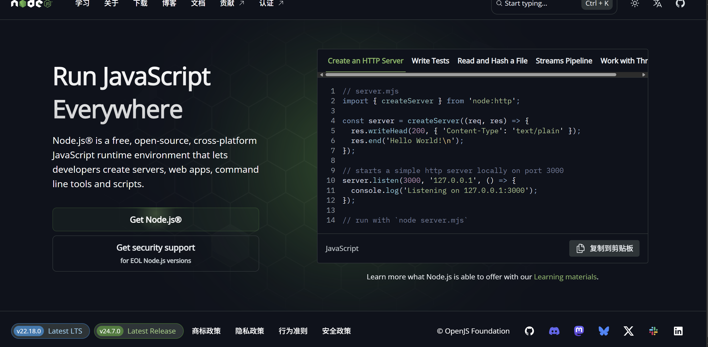
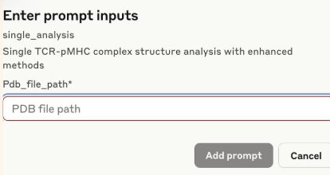
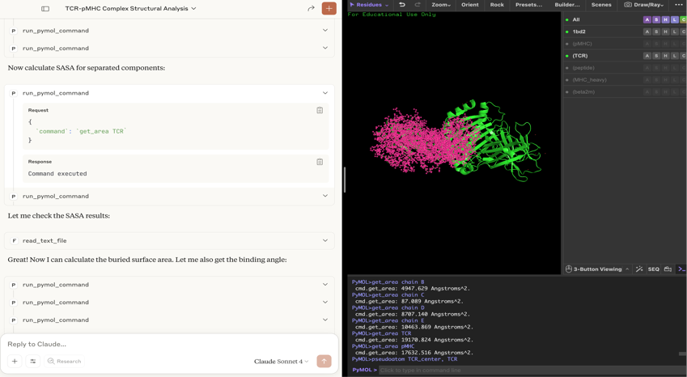

# Automated-protein-interaction-labeler
This project explores a smarter approach to protein complex analysis by employing Large Language Models (LLMs) for automated structural annotation. Our server processes protein structures from PDB files, supporting T-cell receptor (TCR) and peptide-MHC (pMHC) complex interactions to automatically identify chain types and generate quantitative labelings. Through optimized prompting strategies, our pipeline effectively mitigates LLM hallucination, ensuring high reliability.
## Core Capabilities
- ### Automated Chain Identification: Read Header in PDB file for chain classification
- ### Comprehensive Interaction Analysis: 
  - Hydrogen bond networks
  - Salt bridges
  - Hydrophobic interactions
  - π-π stacking interactions
  - Interface SASA calculations
  - Binding angle measurements
- ### Batch Processing: Analyze multiple PDB files with real-time progress tracking
- ### Data Integrity: Built-in verification during data collection 
## Requirements
- Python 3.8+
- PyMOL (with Python API)
- Claude Desktop 
- MCP (Model Context Protocol) server framework
- MCP Server Plugins ：pymol-mcp-server, filesystem-mcp-server

## Quick start
### Installnation
### Pymol-mcp-server
For more detailed informations and server, click this link https://github.com/ChatMol/molecule-mcp
1. Go to Claude > Settings > Developer > Edit Config > claude_desktop_config.json to include the following:
```json
{
  "mcpServers": {
    "pymol": {
      "command": "/path/to/mcp",
      "args": [
        "run",
        "/path/to/molecule-mcp/pymol_server.py"
      ]
     }
  }
}
```
3. Install mcp and get the script
```bash
pip install "mcp[cli]" chatmol
which mcp
```
Copy this path for the next step and replace /path/to/mcp with the path to mcp.
4. To get the path to molecule-mcp.
```bash
git clone https://github.com/ChatMol/molecule-mcp.git
cd molecule-mcp
pwd
```
the path to molecule-mcp will be displayed. Copy this path for the next step and replace /path/to/molecule-mcp with the path to molecule-mcp.

### filesystem-mcp-server
1. Download Node.js     https://nodejs.org/zh-cn


2. Use npx to install and run the server
3. Go to Claude > Settings > Developer > Edit Config > claude_desktop_config.json to include the following:
### Mac/linux
```jason
{
  "mcpServers": {
    "filesystem": {
      "command": "npx",
      "args": [
        "-y",
        "@modelcontextprotocol/server-filesystem",
        "/Users/username/Desktop",
        "/Users/username/Downloads"
      ]
    }
  }
}
```
### Windows
```jason
{
  "mcpServers": {
    "filesystem": {
      "command": "npx",
      "args": [
        "-y",
        "@modelcontextprotocol/server-filesystem",
        "C:\\Users\\username\\Desktop",
        "C:\\Users\\username\\Downloads"
      ]
    }
  }
}
```
Note: In configuration files, Windows must use \\\

Remember to restart Claude after configuring.
## Usage
1. Update file paths in the server configuration with your local values.
2. Plug the server into Claude.
```jason
   "TCR-pMHC-Analyzer": {
      "command": "path to mcp",
      "args": ["path to TCR-pMHC-Analyze server"]}
```
3. Enter the PDB file path to begin processing.


User input surface

## Example Result
Once the PDB file address is entered, Claude will attempt to connect to your local PyMOL software, locate your PDB file, and load it into PyMOL. After reading the information in the header, it will begin to identify chain types and generate quantitative labelings.



  Screenshoot of the operation process
  
Note: If your PyMOL and Claude still fail to connect properly after successfully installing the pymol-mcp-server, you can try copying the following code into PyMOL's command line.
```python
import threading
try:
    import xmlrpc.server
    from pymol import cmd
    def start_server():
        server = xmlrpc.server.SimpleXMLRPCServer(("localhost", 9123), allow_none=True)
        server.register_function(lambda x: cmd.do(x), 'do')
        server.register_function(cmd.get_names, 'get_names')
        print("Remote control server started on port 9123.")
        server.serve_forever()
    thread = threading.Thread(target=start_server)
    thread.daemon = True
    thread.start()
    print("Server thread has been started.")
except Exception as e:
    print("Error starting the server:", e)
```
After the entire operation is completed, a CSV file will be generated on your desktop, and Claude will also organize and display some data results in the interface. You can cross-reference the data in the following .txt file and the CSV table to ensure the authenticity of all data.


Note：Please ensure to check whether Claude is writing data to a .txt file during operation. Missing .txt output may result in unreliable CSV results.

## Acknowledgment
- Xi'an Jiaotong-Liverpool University (XJTLU) Summer Undergraduate Research Fellowship (SURF)
- SURF Codes:surf-2025-0465


